# Tool-for-YOLO-Dataset-Augment
一个简单的的 YOLO 目标检测数据集增强与划分工具

## 简介
该脚本工具主要用于辅助制作 YOLO 目标检测数据集，对于已有的、已标注过的数据（图片以及对应的标签文件），通过多种手段进行数据增强，并将增强后的数据按照训练集、验证集、测试集进行分装，最后生成 data.yaml 文件，实现将杂乱的原生数据集快速增强包装，投入使用。

## 功能详解
首先，确保原生数据集已完成标注，并将图片与标签文件分别放在 images 和 labels 文件夹下
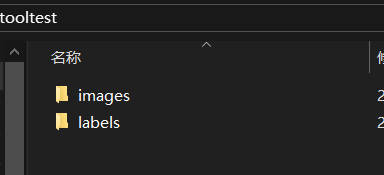   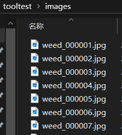   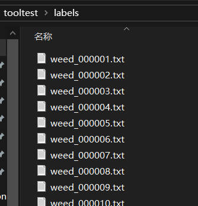

进入脚本程序，将原生数据集文件夹拖入窗口（或是直接输入数据集的绝对路径），回车进入主界面
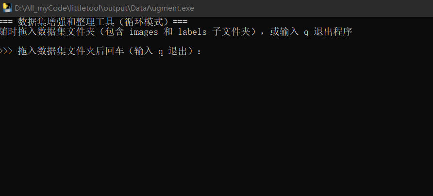
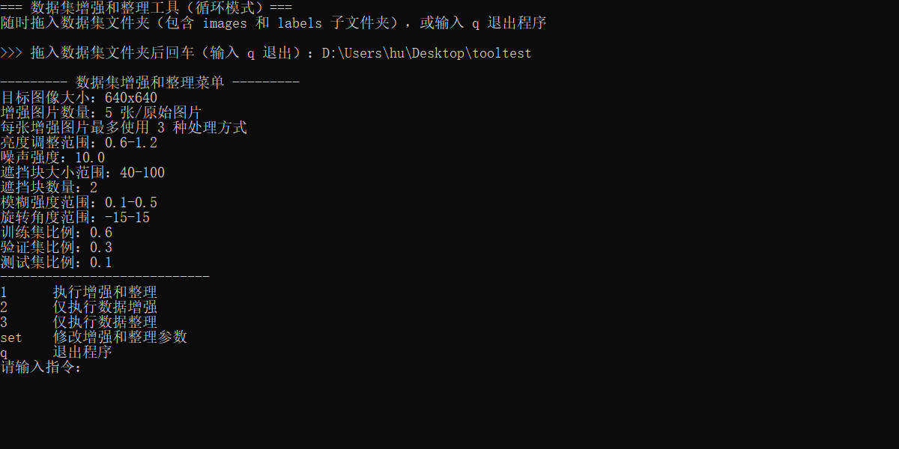

可以通过"set"调节相关参数，包括数据增强参数与数据集分类比例
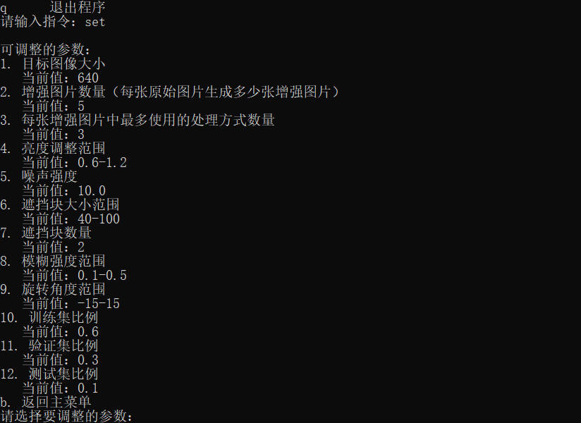
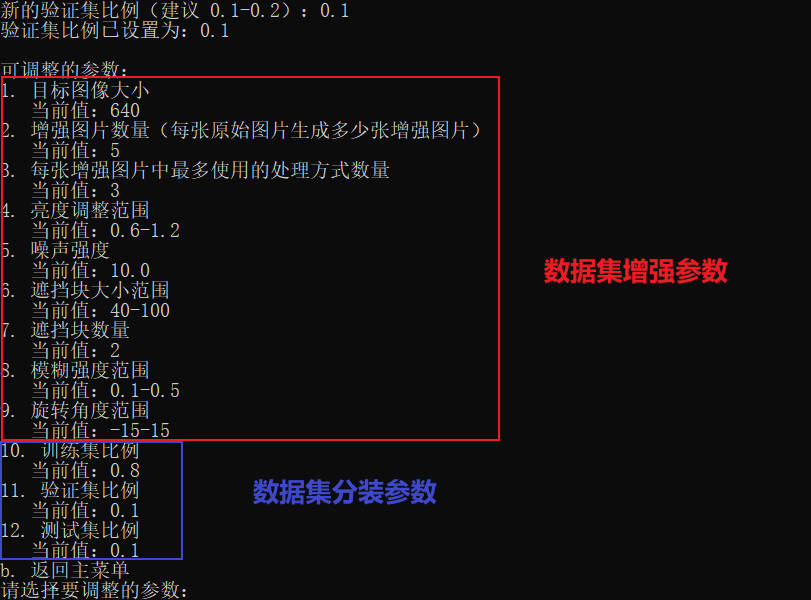

(⚠️注意：请确保比例等参数正确，目前程序尚未加入参数合理性检验，因此异常的参数设置很可能导致运行失败)

调整完成后返回主菜单，根据需求选择对应的功能(增强/分类)，确认后开始执行数据增强。在执行分类包装时，需要按序号顺序填写标签名称（比如在本数据集中，0代表corn，1代表weed）
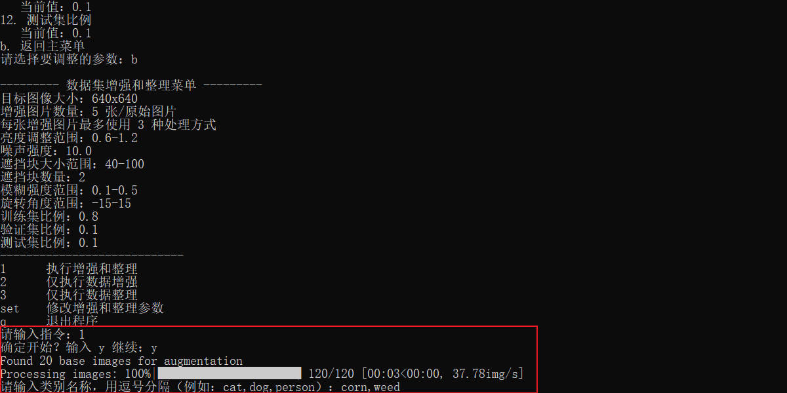
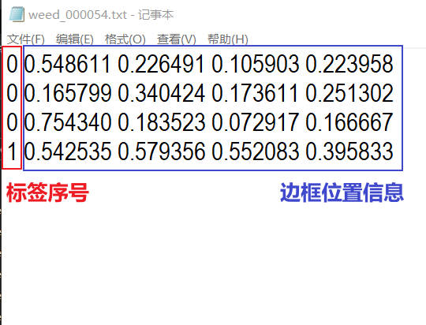

运行完成后，即可在脚本程序的同级目录下找到处理结果，其中数据增强的结果和分类结果会分开存放
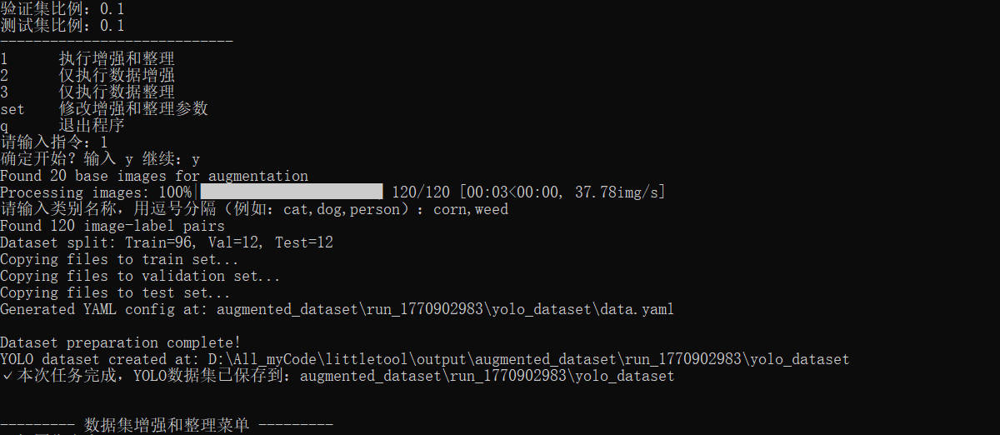
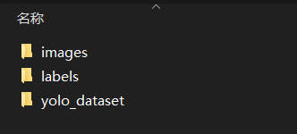
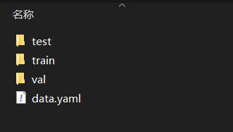
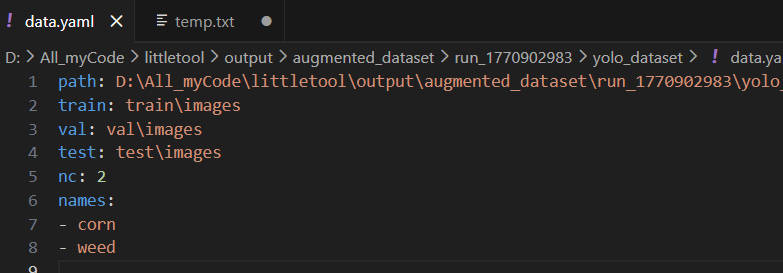
