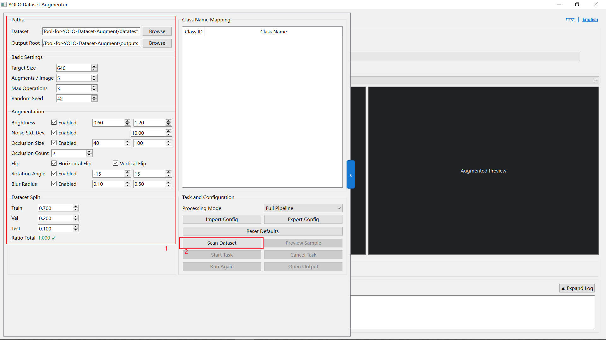
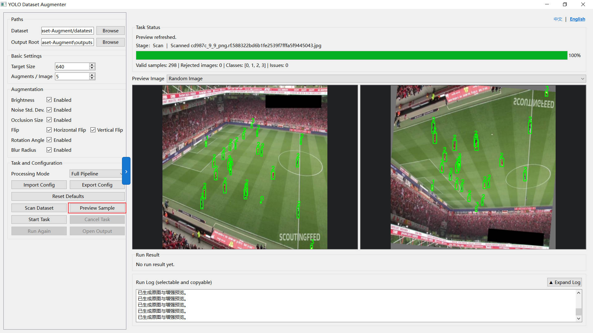
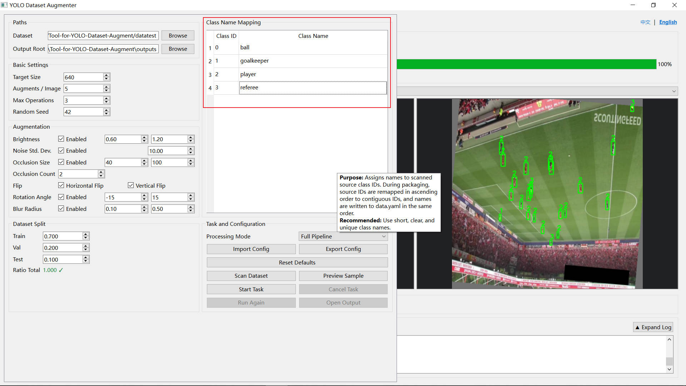
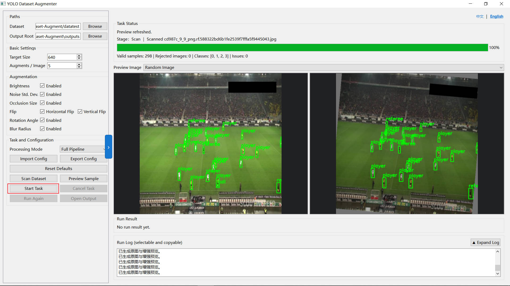
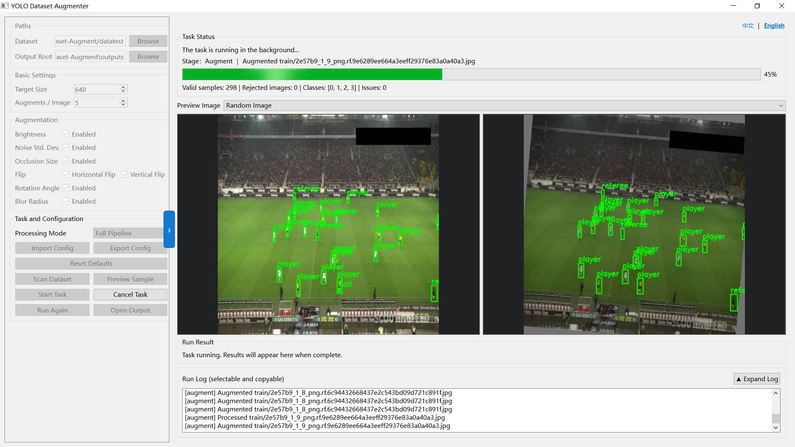
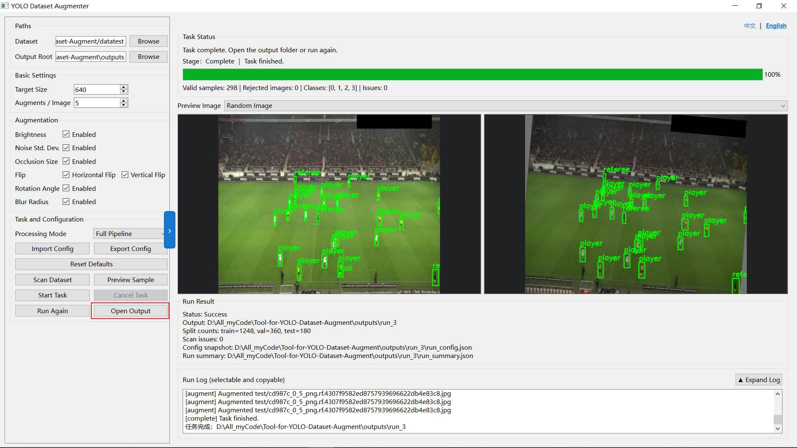

# Tool-for-YOLO-Dataset-Augment

**A desktop tool for augmenting, inspecting, and splitting YOLO object detection datasets**

> v3.0 is the first PyQt6 desktop release of this project; v1.x and v2.x both used a terminal user interface (TUI).

[简体中文](README_zh.md) | [English](README.md)

## 📖 Introduction
This project is a local dataset preprocessing tool for YOLO object detection models. Building on the core capabilities of the first two TUI generations, v3.0 has been rebuilt as a desktop application. Dataset selection and scanning, augmentation settings, class name mapping, effect previews, background processing, progress monitoring, and result access are all available in a single PyQt6 window.

The application supports seven image augmentation methods and three execution modes: Full Pipeline, Augment Only, and Package Only. Full Pipeline splits the source samples first, then generates augmented versions separately within Train, Val, and Test. This processing order prevents data leakage caused by related samples being placed in different splits. Standard dataset outputs also use contiguous class IDs and include a `data.yaml` file.

---

## ✨ Features
The application can scan, preview, and batch-process a source YOLO dataset. Users can configure the target size, number of augmented copies, random seed, number of combined operations, and dataset split ratios. Images and their label boxes are always transformed together. The main augmentation methods are described below:

1. **Brightness**
   Randomly brightens or darkens an image to simulate strong exposure under direct sunlight during the day, or insufficient light on cloudy days and at dusk. This helps the model adapt to different lighting conditions. The brightness adjustment range can be configured in the settings.

2. **Gaussian Noise**
   Randomly adds a layer of coarse, snow-like speckles to an image, simulating noise produced by low-quality cameras, night-vision devices, or high-ISO photography. This improves model robustness on low-quality images. The noise intensity range can be limited in the settings.

3. **Occlusion**
   Places several opaque color blocks at random positions in an image to cover parts of the scene, simulating obstruction by other objects and encouraging the model to learn local target features. The block size range can be limited in the settings to prevent blocks from completely hiding a target or being too small to provide a useful augmentation effect.

4. **& 5. Horizontal/Vertical Flip**
   Flips an image horizontally or vertically and updates its annotation boxes accordingly. These operations should only be enabled when the class semantics remain valid after flipping. Vertical flips are generally more suitable for orientation-insensitive scenarios such as aerial or microscopic imagery.

6. **Rotation**
   Randomly rotates an image around its center by an angle within the configured range. Empty areas are filled with a uniform value, improving the model's ability to handle pose variation. The rotation angle range can be configured in the settings.
   > ⚠️ **Note**: After rotation, each new annotation box is created as an axis-aligned bounding rectangle enclosing the transformed original box. This can reduce annotation precision, so a large rotation range is generally not recommended.

7. **Gaussian Blur**
   Blurs image details and edges to simulate failed lens focus or motion blur caused by a fast-moving target.

---

## 🖥️ Major Improvements in v3.0

- **Complete desktop workflow**: Scanning, parameter configuration, class mapping, previewing a selected image, task execution, cancellation, logs, and result access are integrated into one window.
- **Chinese and English interface**: Switch instantly between Chinese and English from the upper-right corner. Parameter names, execution modes, runtime status, and hover descriptions update together.
- **Hover help for parameters**: Basic parameters, augmentation settings, split ratios, execution modes, and task buttons provide descriptions of their purpose, special values, and recommended ranges.
- **Controlled randomness**: Batch processing supports a fixed random seed for reproducible augmentation and split results, while every preview click still generates a new random effect.
- **Safer input scanning**: Detects missing labels, corrupted images, duplicate base names, empty label files, and invalid annotation lines. Empty labels can be retained as negative samples.
- **Three output modes**: Augment Only outputs flat `images/labels` directories; Package Only outputs an unaugmented standard YOLO dataset; Full Pipeline outputs a standard YOLO dataset that is split before augmentation.
- **Background tasks and state recovery**: Time-consuming scanning and processing run in background threads, with staged progress, copyable logs, safe cancellation, rerun support, and direct access to the output directory.
- **Configuration and run records**: Supports importing and exporting configurations, restoring defaults, and remembering recent settings. Successful tasks save `run_config.json` and `run_summary.json`.
- **Compact, expandable layout**: The parameter panel and runtime log can be expanded independently. The class mapping table scrolls separately, reducing full-page scrolling and accidental value changes caused by the mouse wheel.

## 🔄 Version History

- **v1.x**: Introduced YOLO dataset scanning, basic augmentation, and the terminal interaction workflow.
- **v2.x**: Further improved TUI parameter configuration, previews, dataset splitting, and training-format packaging.
- **v3.0**: Migrated to a PyQt6 desktop application, separated the core and UI layers, and added a bilingual interface, background tasks, configuration persistence, parameter guidance, and a data-leakage prevention workflow.

---

## 🚀 User Guide

### 1. Prepare the Data
First, make sure the source dataset has been annotated, then place image files and label files in the `images` and `labels` directories respectively.

### 2. Load the Dataset and Preconfigure Parameters
Open the application, select or manually enter the source dataset directory, adjust the parameters as needed, and click `Scan Dataset`.

### 3. Preview Effects and Map Class Names
After scanning, click `Preview Sample`. You can randomly select or explicitly choose an image from the source dataset and compare the original with its augmented preview.

You can further adjust the augmentation parameters based on the preview. Dataset packaging also generates a `data.yaml` file, while the original labels contain only numeric class indices. You therefore need to edit the `Class Name Mapping` table manually and map each numeric index to its actual class name.

### 4. Run the Task and View the Results
After completing the settings, click `Start Task`. The application will automatically split, augment, organize, and package the source dataset, producing a standard YOLO dataset directory. When the task finishes, click `Open Output` to access the result quickly.

---

## 🙏 Acknowledgements
The demonstration images and test dataset used in this project's README come from **Roboflow Universe**. We sincerely thank the original authors:

- **Dataset**: Football Players Detection
- **Source**: [Roboflow Universe - Football Players Detection](https://universe.roboflow.com/roboflow-jvuqo/football-players-detection-3zvbc)
- **Usage**: Used solely to demonstrate and preview this project's functionality.
