# Tool-for-YOLO-Dataset-Augment
**一个简单的 YOLO 目标检测数据集增强与划分工具**

## 📖 简介
本项目是一款专为 YOLO 系列目标检测模型设计的高效数据集预处理工具。对于已有的、已标注过的数据（图片以及对应的标签文件），通过终端交互界面 (TUI) 提供 7 种物理变换增强方案，并支持数据集自动划分为 **Train / Val / Test** 结构，最后生成 `data.yaml` 文件，实现将杂乱的原生数据集快速增强、包装，以投入使用。

---

## ✨ 功能介绍
脚本能够对于原生数据集进行全自动批量处理，并且可以自由设定参数，包括对图像分辨率的缩放、增强数量与方式的设定、数据集各部分比例的划分等。下面是主要的增强算法介绍：

1. **亮度变换 (Brightness)**
   随机将图片调亮或调暗，模拟白天受阳光直射的强曝光，或者阴天/黄昏时的光线不足，让模型适应不同的光照条件。可以在设置中对亮度变换的范围进行调节。

2. **高斯噪声 (Gaussian Noise)**
   给图像随机撒上一层粗糙的“雪花点”颗粒，模拟劣质摄像头、夜视仪或高 ISO 拍摄时产生的噪点，提升模型对低画质画面的鲁棒性。可以在设置中对噪声粗糙度范围进行限制。

3. **随机遮挡 (Occlusion)**
   在图片上随机位置贴上几个不透明的色块，遮盖住部分画面，模拟画面受到障碍物遮挡的情况，强迫模型去学习目标的局部特征。可以在设置中限制挡块的大小范围，避免挡块面积过大导致目标完全遮挡，或是面积过小导致增强作用受限。

4. **& 5. 水平/垂直镜像 (H/V Flip)**
   将图片左右/上下颠倒，用于提高模型对任意姿态下的画面目标进行识别。

6. **几何旋转 (Rotation)**
   以图片中心为轴，随机歪斜一定的角度，其余部分用黑色填充，用于提高模型对任意姿态下的画面目标进行识别。可以在设置中调节转动的角度范围。
   > ⚠️ **注意**：增强后的标注框会通过对原有标注框进行“外接”的方式创建新的标注框，因此标注的准确性可能会有一定的下降，通常不建议设置大角度的旋转范围。

7. **高斯模糊 (Blur)**
   将图像细节边缘晕染模糊，模拟镜头对焦失败，或者目标因为快速移动而产生的动态模糊（拖影）。

---

## 🚀 使用指南

### 1. 数据准备
首先，确保原生数据集已完成标注，并将图片与标签文件分别放在 `images` 和 `labels` 文件夹下。

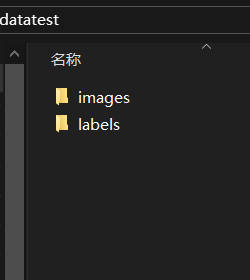
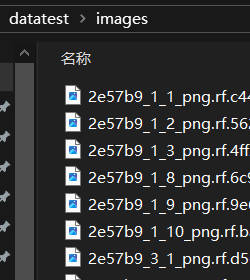
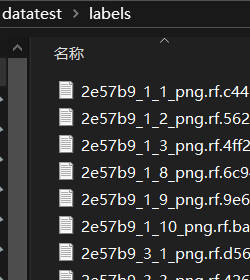

### 2. 挂载数据集
进入脚本程序，将原生数据集文件夹拖入窗口（或是直接输入数据集的绝对路径），回车进入主界面，此时会展示扫描结果。

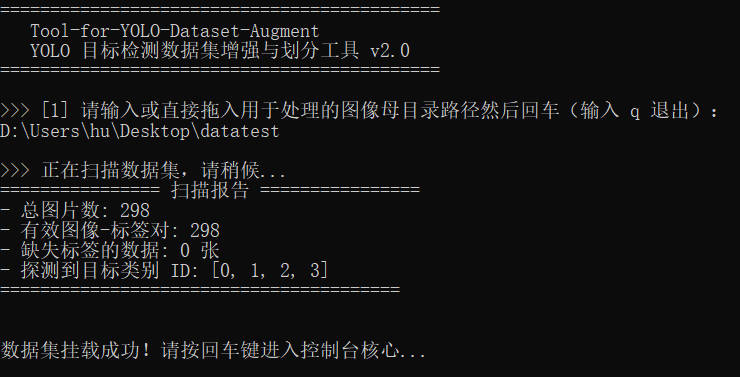

### 3. 参数调节
在主菜单，会展示各种参数信息，可以输入 `set` 对其中的每项参数进行调节。

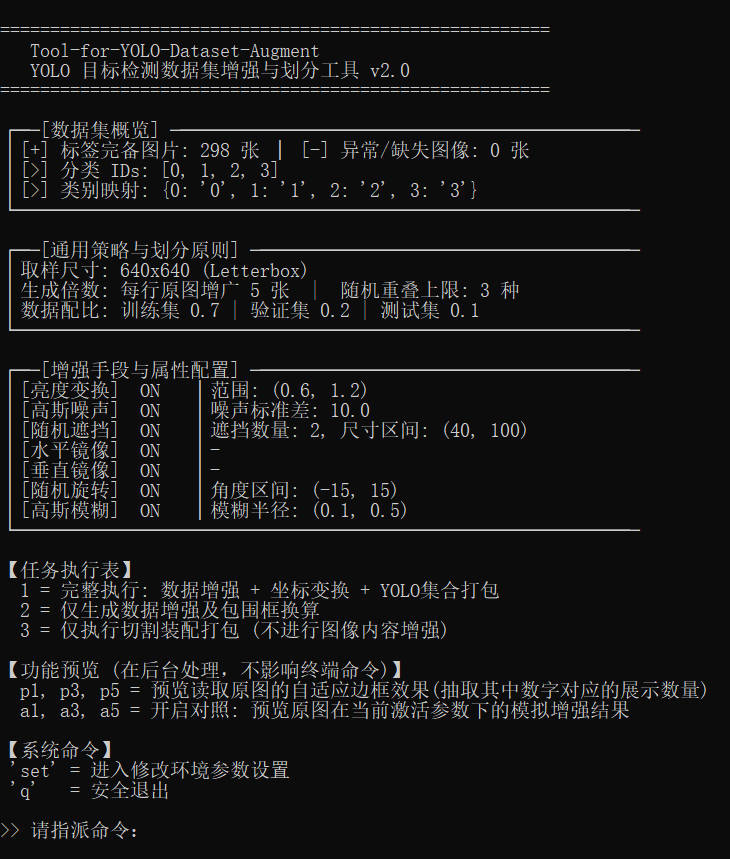
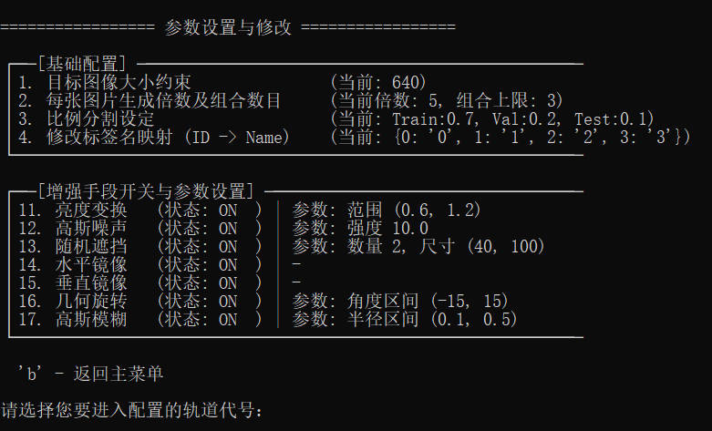

### 4. 标签映射与原图预览
由于划分数据集时要生成 `data.yaml` 文件，而默认的标签信息中只包含数字索引，因此需要对标签进行映射。若不确定对应关系，可以使用主菜单里的**原图预览功能 (p系列命令)**，随机查看若干张图片的标注情况，确保标签名与索引的正确对应。

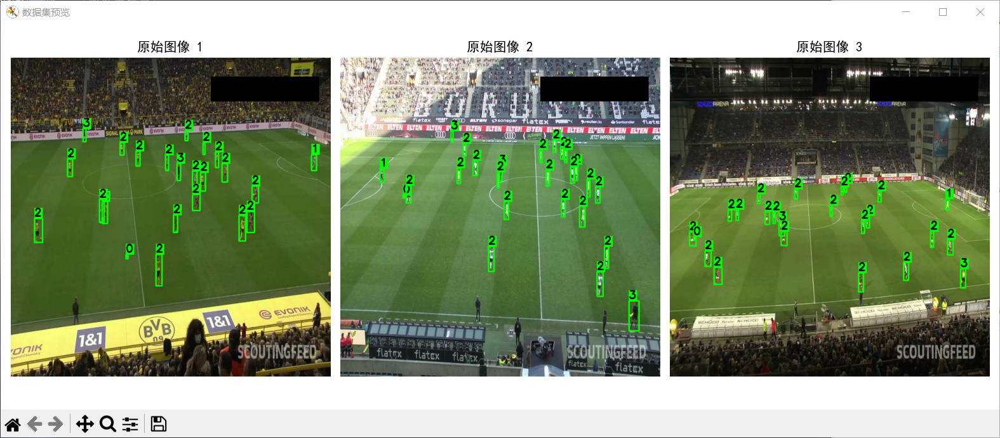
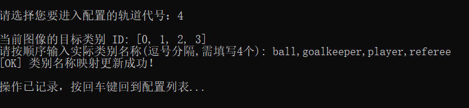
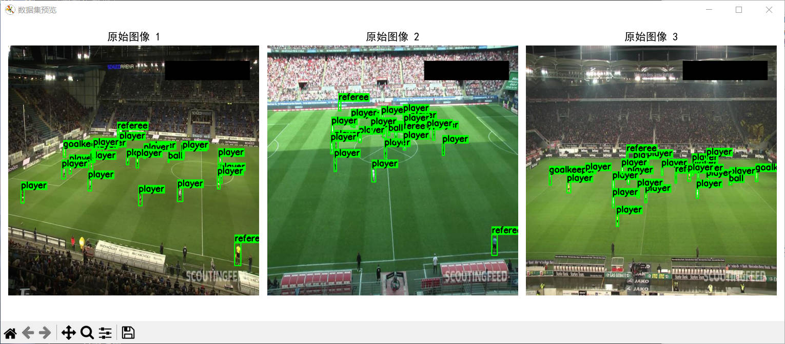

### 5. 增强效果预览
在设定参数的过程中，也可以随时使用主菜单的**增强预览功能 (a系列命令)**，随机选取若干张图片并按照设定进行增强，对比展示增强前后的效果。如果对于增强的效果不满意，可以根据具体情况对特定参数进行再调节，直至符合预期。

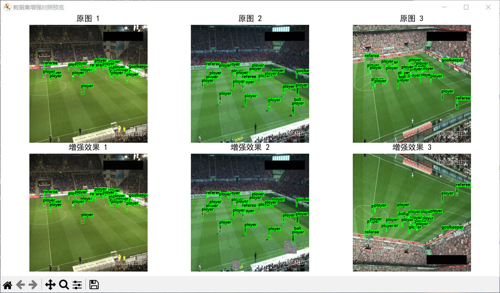

### 6. 执行任务与结果查看
设置妥当后，就可以对整个数据集进行增强/分类。等待运行完成后，可以在同级文件夹的 `augmented_dataset` 目录下找到处理结果。
- `images` 和 `labels`：增强后的全量数据。
- `yolo_dataset`：划分、包装好的数据集，可以直接用于 YOLO 训练。

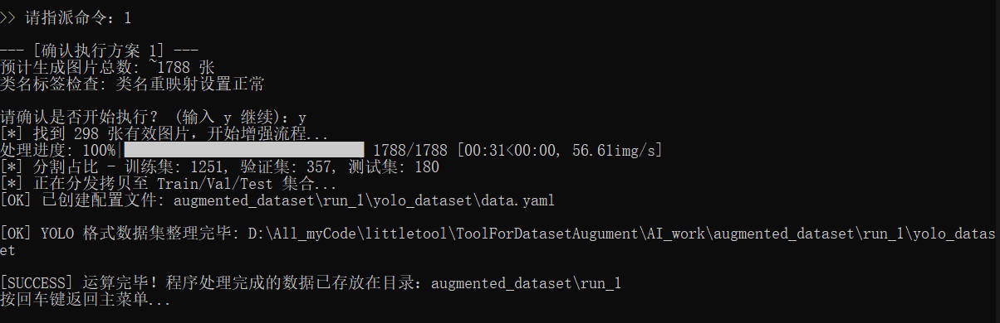
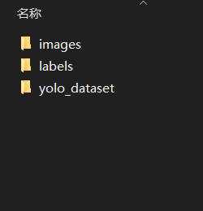
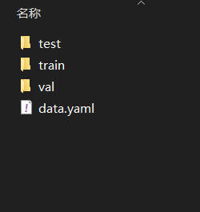

---

## 📅 预计后续会进行的更新
- [ ] 加入设置参数记忆功能，避免每次启动重新设置参数。
- [ ] 开发图形化 UI 界面版本 (PyQt6)。

## 🙏 致谢 / Credits
本项目 README 中的演示图片与测试数据集来源于 **Roboflow Universe**，特此向原作者表示感谢：

- **数据集名称**：Football Players Detection
- **来源链接**：[Roboflow Universe - Football Players Detection](https://universe.roboflow.com/roboflow-jvuqo/football-players-detection-3zvbc)
- **用途**：仅用于本项目功能展示与效果预览。
