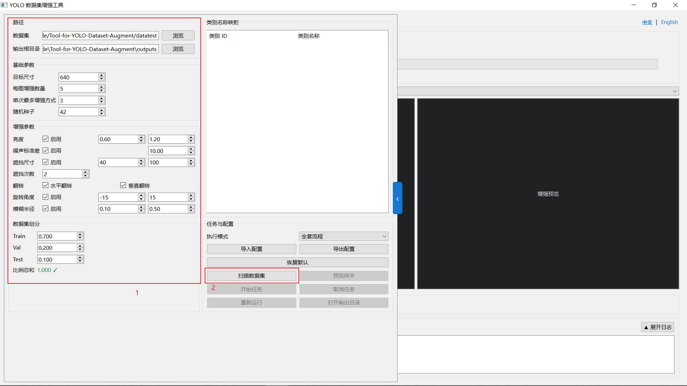
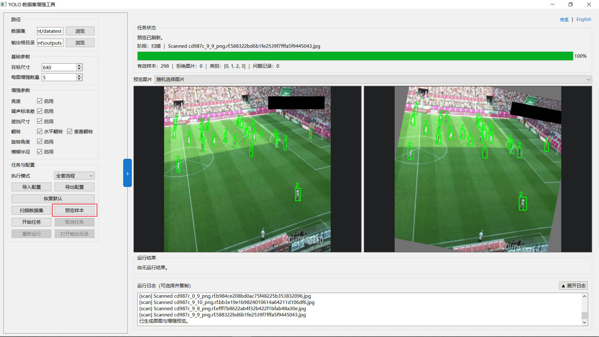
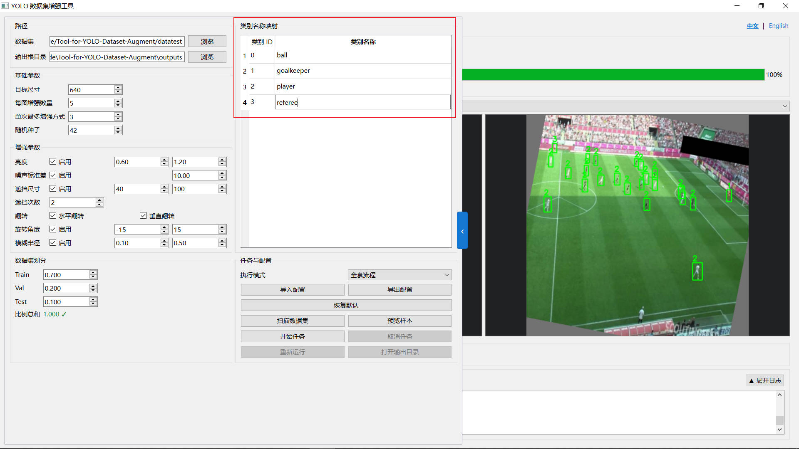
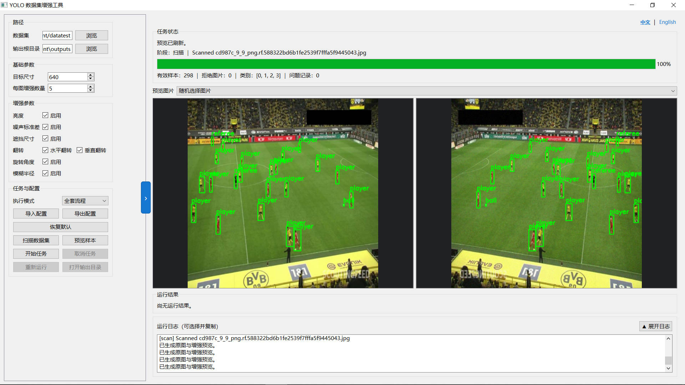
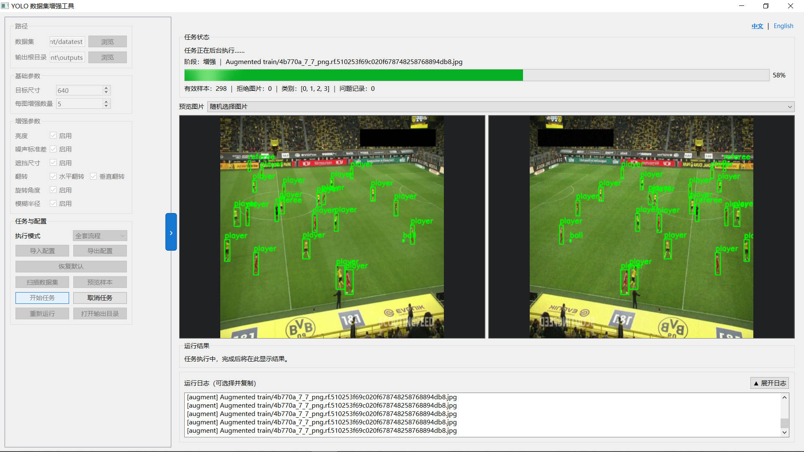
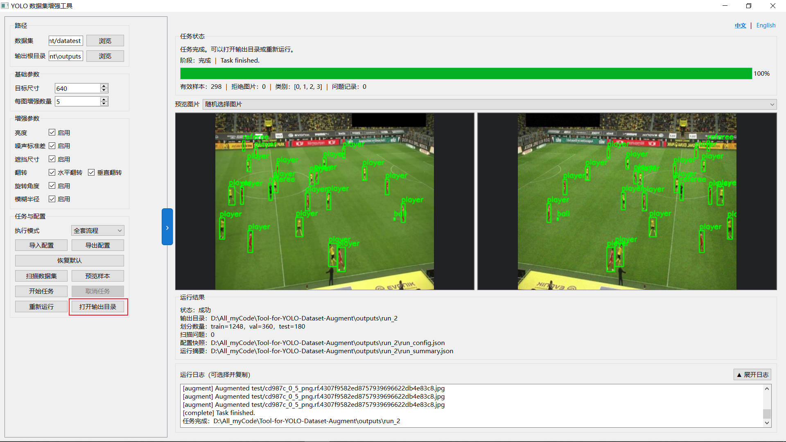

# Tool-for-YOLO-Dataset-Augment

**一个面向 YOLO 目标检测数据集的桌面增强、检查与划分工具**

> v3.0 是本项目首个 PyQt6 桌面版本；v1.x 与 v2.x 均采用终端交互界面（TUI）。

[简体中文](README_zh.md) | [English](README.md)

## 📖 简介
本项目是一款面向 YOLO 系列目标检测模型的本地数据集预处理工具。v3.0 在前两代 TUI 版本的核心能力基础上完成桌面化重构，可在一个 PyQt6 窗口中完成数据集选择与扫描、增强参数配置、类别名称映射、效果预览、后台执行、进度查看和结果打开。

程序支持 7 种图像增强方式，以及“全套流程”“只增强”“只分类包装”三种执行模式。全套流程会先划分原始样本，再分别在 Train / Val / Test 内部生成增强版本，从处理顺序上避免同源样本跨集合造成的数据泄漏；标准数据集输出会同时生成连续类别 ID 和 `data.yaml`。

---

## ✨ 功能介绍
程序能够对原始 YOLO 数据集进行扫描、预览和批量处理，并允许设置目标尺寸、增强数量、随机种子、操作组合数量及数据集划分比例。增强图片与标签框始终同步变换。下面是主要的增强算法介绍：

1. **亮度变换 (Brightness)**
   随机将图片调亮或调暗，模拟白天受阳光直射的强曝光，或者阴天/黄昏时的光线不足，让模型适应不同的光照条件。可以在设置中对亮度变换的范围进行调节。

2. **高斯噪声 (Gaussian Noise)**
   给图像随机撒上一层粗糙的“雪花点”颗粒，模拟劣质摄像头、夜视仪或高 ISO 拍摄时产生的噪点，提升模型对低画质画面的鲁棒性。可以在设置中对噪声粗糙度范围进行限制。

3. **随机遮挡 (Occlusion)**
   在图片上随机位置贴上几个不透明的色块，遮盖住部分画面，模拟画面受到障碍物遮挡的情况，强迫模型去学习目标的局部特征。可以在设置中限制挡块的大小范围，避免挡块面积过大导致目标完全遮挡，或是面积过小导致增强作用受限。

4. **& 5. 水平/垂直镜像 (H/V Flip)**
   将图片左右或上下翻转，并同步调整标注框。只有在翻转后类别语义仍然成立时才建议启用；垂直翻转通常更适合航拍、显微等方向不敏感场景。

6. **几何旋转 (Rotation)**
   以图片中心为轴随机旋转一定角度，空白区域使用统一填充值补齐，用于提升模型对姿态变化的适应能力。可以在设置中调节旋转角度范围。
   > ⚠️ **注意**：增强后的标注框会通过对原有标注框进行“外接”的方式创建新的标注框，因此标注的准确性可能会有一定的下降，通常不建议设置大角度的旋转范围。

7. **高斯模糊 (Blur)**
   将图像细节边缘晕染模糊，模拟镜头对焦失败，或者目标因为快速移动而产生的动态模糊（拖影）。

---

## 🖥️ v3.0 主要改进

- **完整桌面工作流**：扫描、参数配置、类别映射、指定图片预览、执行、取消、日志和结果入口集中在同一窗口。
- **中英文界面**：右上角可即时切换中文与 English，参数名称、执行模式、运行状态和悬停说明会同步切换。
- **参数悬停帮助**：基础参数、增强参数、划分比例、执行模式及任务按钮均提供作用说明、特殊值含义和建议区间。
- **可控随机性**：批处理支持固定随机种子以复现增强与划分结果；预览每次点击仍会生成新的随机效果。
- **更安全的输入扫描**：识别缺失标签、损坏图片、重复主文件名、空标签和非法标注行；空标签可作为负样本保留。
- **三种输出模式**：只增强输出平铺 `images/labels`；只分类包装输出未增强的标准 YOLO 数据集；全套流程输出先划分、后增强的标准 YOLO 数据集。
- **后台任务与状态恢复**：耗时扫描和处理在后台线程执行，支持阶段进度、可复制日志、安全取消、重新运行和打开结果目录。
- **配置与运行记录**：支持配置导入、导出、恢复默认和最近设置记忆；成功任务保存 `run_config.json` 与 `run_summary.json`。
- **紧凑可展开布局**：参数栏和运行日志可独立展开，类别映射表单独滚动，减少页面滚动和滚轮误操作。

## 🔄 版本演进

- **v1.x**：完成 YOLO 数据集扫描、基础增强和终端交互流程。
- **v2.x**：继续完善 TUI 参数配置、预览、数据集划分与训练格式包装。
- **v3.0**：迁移为 PyQt6 桌面应用，重构核心与界面分层，并加入双语界面、后台任务、配置持久化、参数提示和防数据泄漏流程。

---

## 🚀 使用指南

### 1. 数据准备
首先，确保原生数据集已完成标注，并将图片与标签文件分别放在 `images` 和 `labels` 文件夹下。

### 2. 挂载数据集与参数预调节
进入程序界面，选定或手动输入原生数据集文件夹位置，并根据需求适当调整各项参数后，点击 `扫描数据集` 。

### 3. 效果预览与标签映射
完成扫描后，点击 `预览样本` ，可以随机选定或指定一张原生数据集中的图片，对照查看增强前后的图片效果。

根据预览效果，可以对各增强参数进行进一步调整。同时由于划分数据集时要生成 `data.yaml` 文件，而默认的标签信息中只包含数字索引，因此需要对标签进行映射，手动修改 `类别名称映射` 表中的内容，将序号索引映射到真实的标签名称。

### 4. 执行任务与结果查看
完成相关设置后，可以点击 `开始任务` ，程序将自动对原生数据集进行划分、增强以及整理包装，最终输出一个标准的YOLO数据集文件夹，可以在任务结束后点击 `打开输出目录` 快速查看。

---

## 🙏 致谢
本项目 README 中的演示图片与测试数据集来源于 **Roboflow Universe**，特此向原作者表示感谢：

- **数据集名称**：Football Players Detection
- **来源链接**：[Roboflow Universe - Football Players Detection](https://universe.roboflow.com/roboflow-jvuqo/football-players-detection-3zvbc)
- **用途**：仅用于本项目功能展示与效果预览。
